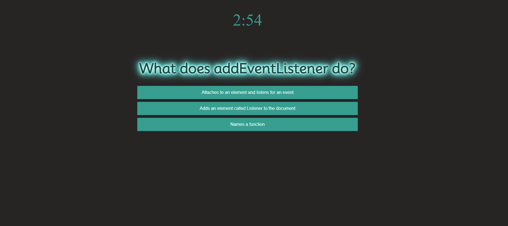

# Javascript_Quiz_Game
Javascript Quiz with a highscore board

## Description
This webpage acts as a timed quiz for practicing javascript skills. Users can access the quiz by clicking on the "click to test your Javascript knowledge" button on the homescreen and navigating through the quiz. Once the quiz is over, the user's score is shown on a leaderboard that compares scores to those already in local storage.

## User Story
AS A coding boot camp student
I WANT to take a timed quiz on JavaScript fundamentals that stores high scores
SO THAT I can gauge my progress compared to my peers

## Acceptance Criteria
GIVEN I am taking a code quiz
WHEN I click the start button
THEN a timer starts and I am presented with a question
WHEN I answer a question
THEN I am presented with another question
WHEN I answer a question incorrectly
THEN time is subtracted from the clock
WHEN all questions are answered or the timer reaches 0
THEN the game is over
WHEN the game is over
THEN I can save my initials and my score

## Screenshots

## Link to Webpage
https://eagersidekick.github.io/Javascript_Quiz_Game/

## License
See the license for more information.
